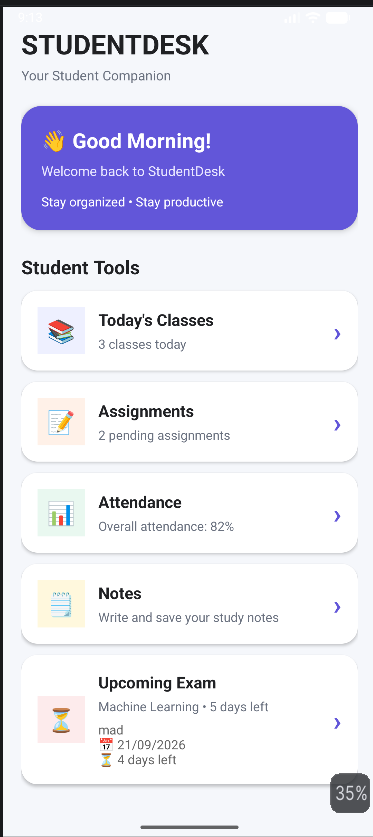
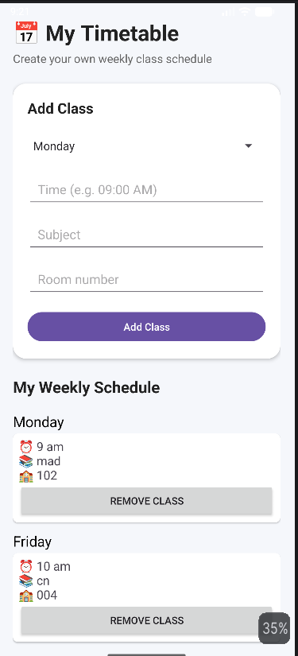
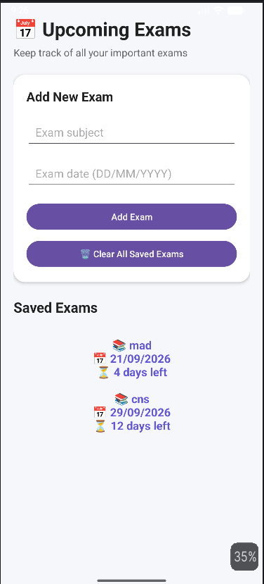
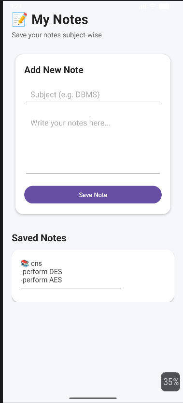

# StudyDesk

## 📱 Project Overview

**StudyDesk** is a simple Android application developed to provide useful student utilities in one place. The application helps students view their timetable, manage assignment information, and calculate attendance percentage.

The project is developed as part of the **Mobile Application Development (MAD)** practical assignment using Android Studio, Kotlin, and XML.

---

## 🎯 Objective

The main objective of StudyDesk is to develop a small-scale Android application that demonstrates practical understanding of:

- Android application development
- Activity and screen navigation
- XML-based user interface design
- Kotlin programming and event handling
- Explicit and Implicit Intents
- Local data storage using SharedPreferences
- Input validation
- Android application testing and APK generation
- Git and GitHub for version control

---

## ✨ Features

### 1. Dashboard
The application starts with a simple dashboard that provides access to the main features of StudyDesk.

### 2. Timetable
- Displays the weekly timetable from Monday to Friday.
- Provides a simple and organized view of the student's schedule.

### 3. Assignment Manager
- Add assignment details such as:
  - Assignment title
  - Subject
  - Due date
- Display added assignments.
- Store assignment information locally using SharedPreferences.
- View previously saved assignments after reopening the application.
- Share assignment information using Android's sharing functionality.

### 4. Attendance Calculator
- Accepts the number of classes attended.
- Accepts the total number of classes.
- Calculates attendance percentage.
- Validates the entered values.
- Checks the 75% attendance threshold and displays an appropriate message.

---

## 🛠️ Technologies Used

- **Android Studio** – Development environment
- **Kotlin** – Application logic
- **XML** – User interface design
- **Android SDK** – Android application development
- **SharedPreferences** – Local assignment storage
- **JSONArray** – Handling multiple saved assignments
- **Git** – Version control
- **GitHub** – Source code repository

---

## 📚 Android Concepts Used

The project demonstrates the following Android concepts:

- Activities
- `onCreate()`
- XML Layouts
- TextView
- EditText
- Button
- CardView
- LinearLayout
- ScrollView
- `findViewById()`
- `setContentView()`
- `setOnClickListener()`
- Explicit Intent
- Implicit Intent
- Toast messages
- SharedPreferences
- Input validation

---

## 🔄 Application Flow

```text
                         StudyDesk
                            |
                       MainActivity
                         Dashboard
                            |
          +-----------------+-----------------+
          |                 |                 |
          v                 v                 v
     Timetable         Assignments       Attendance
          |                 |                 |
          v                 v                 v
     View Schedule      Add / View        Enter Classes
                            |                 |
                            v                 v
                     Save Locally        Calculate %
                            |                 |
                            v                 v
                         Share          Check 75%







